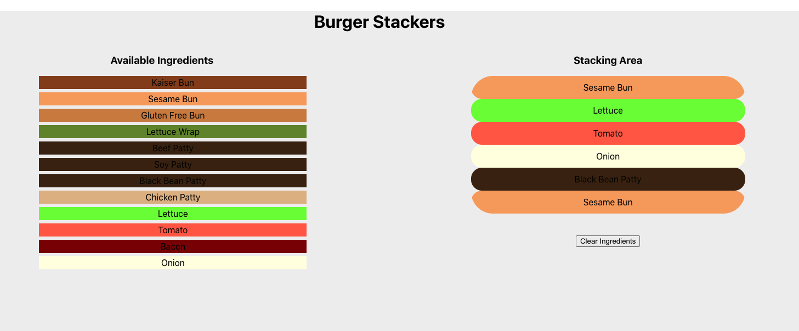

#  Burger Stacker

You will be writing an app that simulates the stacking of a burger. 

The app has a clickable list of ingredients on the left side, which when clicked will add ingredients to the burger to the stacking area on the right side.

Here is a visual of the general layout:



### [Check out the demo deployed here on Heroku!](https://burger-stacker-706.herokuapp.com)

___
## User Stories

* As a user, I want to see all available burger ingredients listed on the left side.
* I want the ability to add any ingredient onto the burger stack by clicking on the ingredient.
* I want to see each ingredient I select added to the top of the burger stack on the right side.
* I want the ability to clear the burger stack so I can start again.
* I want to be able to add as many ingredients of any type as I want (ingredients don't go away.)

___
## Suggested Ways To Get Started

1. Clone down this repo.
1. Take a moment to familiarize yourself with the starter code.
1. Decide what components you may need.
1. Decide what information you will need to pass as props to each component.
1. Decide what the state should be (hint: state will be the information on the page that changes over time).
1. Decide where the state should live.
1. Write a handler function that listens for when an ingredient is clicked and updates state.
1. When state updates we should see an ingredient added to the Burger Stack on the right side of the screen.

### Sample Idea for Component Hierarchy:

```
App
|--IngredientList
|  |--Ingredient(s)
|
|--BurgerStack
|  |--Ingredient(s)
```

### Starter Data:

Here are some ingredients to get you started in the `ingredients.js` file. Feel free to change them or add more.

```js
[
  {name: 'Kaiser Bun', color: 'saddlebrown'},
  {name: 'Sesame Bun', color: 'sandybrown'},
  {name: 'Gluten Free Bun', color: 'peru'},
  {name: 'Lettuce Wrap', color: 'olivedrab'},
  {name: 'Beef Patty', color: '#3F250B'},
  {name: 'Soy Patty', color: '#3F250B'},
  {name: 'Black Bean Patty', color: '#3F250B'},
  {name: 'Chicken Patty', color: 'burlywood'},
  {name: 'Lettuce', color: 'lawngreen'},
  {name: 'Tomato', color: 'tomato'},
  {name: 'Bacon', color: 'maroon'},
  {name: 'Onion', color: 'lightyellow'}
]
```

<details>
  <summary>Help! I don't know where to start!</summary>

  In App.js, start by setting up the scaffolding for your app.
  - You'll want to stub out components for the Ingredients List and the Burger Stack and nest them within your App component.

</details>

<details>
  <summary>Help, I'm still stuck!</summary>

  Start by seeing if you can get the list of ingredients showing up in the `IngredientsList` component.
  - Start by passing the ingredients as a prop from the `App` component to the `IngredientsList` component.
  - Inside of the `IngredientsList` component loop through those ingredients being pass in to create an array of `<li>` tags.
  - Once you have your list of ingredients showing up the next step is to listen for a click on each of the ingredients.
  - When one of those ingredients is clicked you want to add it to `addedIngredients` in the state of `App` component.
  - You can modify the state of `App` in `IngredientsList` by passing down a `setState` function via props!
</details>

___
## BONUSES

* Each ingredient has an associated color. Use this to give each ingredient a nice background color reminiscent of what it looks like in real life.
* Add a form component (simply text input and button) to the ingredient side that lets a user add a new ingredient to the master list of ingredients. If you do this, the ingredients would change over time and would need to live in state.
* Add the ability to "undo" the last ingredient added (only the last one) by clicking a button that will remove that ingredient. Only that top ingredient should have the button for this showing up. When that ingredient is removed, the next one down should then get the button that allows it to be removed. **HINT**: You probably need to add this button to the top `Ingredient` when you render it in the `BurgerStack` component.
___
## Licensing
1. All content is licensed under a CC-BY-NC-SA 4.0 license.
2. All software code is licensed under GNU GPLv3. For commercial use or alternative licensing, please contact legal@ga.co.